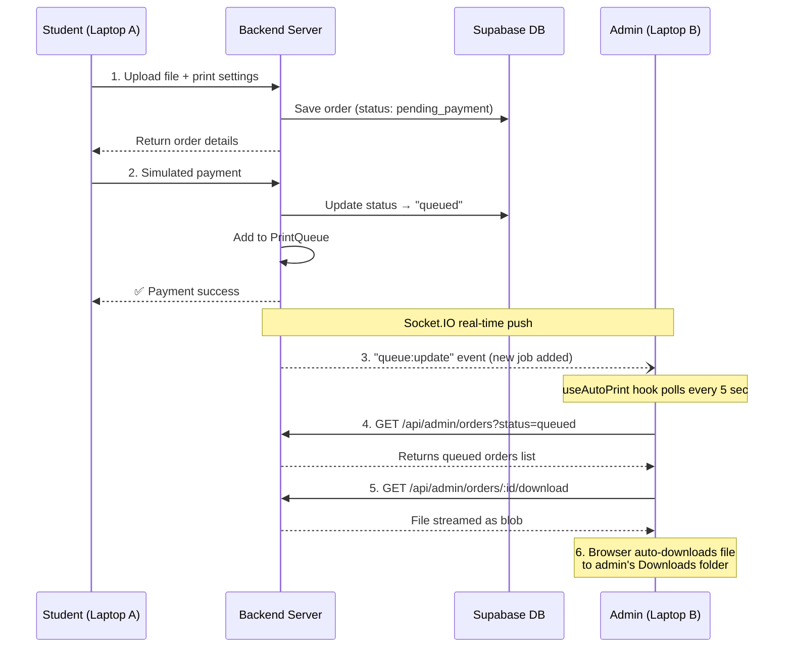

# SmartPrint — Student-to-Admin Xerox Flow Analysis

## ✅ Short Answer: **YES, this will work across two laptops**

If you deploy this website and open it as **Student on Laptop A** and **Admin on Laptop B**, a file uploaded by the student **will automatically appear on the admin's laptop** for printing/xerox. Here's exactly how it works:

---

## 🔄 End-to-End Flow



---

## 🧩 How Each Piece Works

### 1. Student Uploads File (Laptop A)
- **Page**: [UploadPage.tsx](file:///c:/Users/tejas/OneDrive/Desktop/printing%20(1)/printing/frontend/src/pages/UploadPage.tsx)
- Student uploads PDF/DOCX/Image via drag-and-drop
- Selects print settings (copies, B&W/Color, page size, binding)
- File is uploaded to `POST /api/orders` → saved to server's `backend/uploads/` directory
- Order created in Supabase with status `pending_payment`

### 2. Student Pays (Simulated)
- Inline payment form with test card `4242 4242 4242 4242`
- `POST /api/payments/process` → verifies order, runs simulated payment
- On success: order status updated to `queued` in Supabase
- **Crucially**: calls `printQueue.addJob()` which triggers Socket.IO events:
  - `emitToUser()` — notifies the student
  - `emitToAdmins()` — notifies ALL connected admins via `'queue:update'` event

### 3. Admin Receives the File Automatically (Laptop B)

There are **two mechanisms** that deliver the file to the admin:

#### Mechanism A: Real-Time Socket.IO Push
- [socket/index.ts](file:///c:/Users/tejas/OneDrive/Desktop/printing%20(1)/printing/backend/src/socket/index.ts) — Admin joins `'admin'` room on connect (line 52-54)
- [queue.service.ts](file:///c:/Users/tejas/OneDrive/Desktop/printing%20(1)/printing/backend/src/services/queue.service.ts#L34) — `emitToAdmins('queue:update', ...)` fires immediately when a job is added
- [AdminQueuePage.tsx](file:///c:/Users/tejas/OneDrive/Desktop/printing%20(1)/printing/frontend/src/pages/AdminQueuePage.tsx) — Also polls every 5 seconds with `setInterval(fetchQueue, 5000)`

#### Mechanism B: Auto-Download Hook (⭐ The Key Feature)
- [useAutoPrint.ts](file:///c:/Users/tejas/OneDrive/Desktop/printing%20(1)/printing/frontend/src/hooks/useAutoPrint.ts) — This hook runs **only for admin users**
- Polls `GET /api/admin/orders?status=queued` every 5 seconds
- For each **new** queued order it hasn't seen:
  1. Downloads the file as a blob via `GET /api/admin/orders/:id/download`
  2. Creates a hidden `<a download>` element and clicks it programmatically
  3. **Browser silently saves the file to the admin's Downloads folder**
  4. Marks the order as `downloaded_offline` on the backend
- Uses `localStorage` to remember already-downloaded orders (won't download twice)

### 4. Admin Download Endpoint
- [admin.routes.ts](file:///c:/Users/tejas/OneDrive/Desktop/printing%20(1)/printing/backend/src/routes/admin.routes.ts#L157-L192) — `GET /admin/orders/:id/download`
- Streams the actual file from disk with `Content-Disposition: attachment` header
- Requires admin authentication

---

## ⚠️ Potential Issues to Watch For

### Issue 1: Backend URL Configuration
The frontend `useAutoPrint` hook calls `/api/admin/orders/...` using **relative URLs**. When deployed:
- Both laptops must access the **same backend server URL** (e.g., `https://yourapp.com`)
- The backend must be accessible from both laptops over the network

### Issue 2: File Storage
Currently files are saved to `backend/uploads/` **on the server's local disk**:
- ✅ Works fine if backend runs on a single server
- ❌ Won't work with multiple server instances unless you use shared storage (S3, etc.)

### Issue 3: Browser Download Permissions
- Chrome/Edge may **block multiple automatic downloads** unless the user allows it
- The admin should **allow automatic downloads** from the site in browser settings
- First-time download might show a prompt — subsequent ones should be silent

### Issue 4: Status Sync Endpoint Missing
The `useAutoPrint` hook tries to update status via `POST /api/status`:
```typescript
await axios.post('/api/status', { jobId: orderId, status: 'downloaded_offline' }, ...);
```
> [!WARNING]
> **There is no `POST /api/status` route defined in your backend!** The [admin.routes.ts](file:///c:/Users/tejas/OneDrive/Desktop/printing%20(1)/printing/backend/src/routes/admin.routes.ts) has `PATCH /admin/orders/:id/status` but the hook calls `POST /api/status`. This means:
> - The file **WILL download** successfully ✅
> - But the status update will **silently fail** with a 404 ❌
> - The order will stay as "queued" in the database instead of becoming "downloaded_offline"

### Issue 5: Simulated Print Queue Auto-Processing
The [queue.service.ts](file:///c:/Users/tejas/OneDrive/Desktop/printing%20(1)/printing/backend/src/services/queue.service.ts#L43-L47) checks `process.env.USE_PHYSICAL_PRINTER`:
```typescript
if (process.env.USE_PHYSICAL_PRINTER !== 'true') {
    if (!this.processing) {
        this.processNext();  // auto-simulates printing
    }
}
```
> [!IMPORTANT]
> Without `USE_PHYSICAL_PRINTER=true` in your backend `.env`, the queue will **auto-process and mark orders as "completed"** before the admin's auto-download can pick them up (since it polls for `status=queued`). You need to add `USE_PHYSICAL_PRINTER=true` to the backend `.env` to prevent this race condition.

---

## ✅ Summary Table

| Feature | Status | Notes |
|---|---|---|
| Student uploads file | ✅ Works | Saved to server disk |
| Student pays & order queued | ✅ Works | Simulated payment, adds to queue |
| Admin sees queue in real-time | ✅ Works | Socket.IO + 5s polling |
| File auto-downloads to admin | ✅ Works | `useAutoPrint` hook handles this |
| Status updated after download | ❌ Bug | `POST /api/status` route doesn't exist |
| Works across 2 laptops on same network | ✅ Works | Both must point to same backend |
| Queue doesn't auto-complete | ⚠️ Needs Config | Set `USE_PHYSICAL_PRINTER=true` |

---

## 🔧 Two Fixes Needed for Reliable Cross-Laptop Operation

1. **Add `USE_PHYSICAL_PRINTER=true`** to `backend/.env` — prevents the simulated printer from auto-completing jobs before admin downloads them

2. **Fix the status update URL** in `useAutoPrint.ts` — change `POST /api/status` to `PATCH /api/admin/orders/${orderId}/status` with body `{ status: 'downloaded_offline' }`

Want me to apply these fixes?
