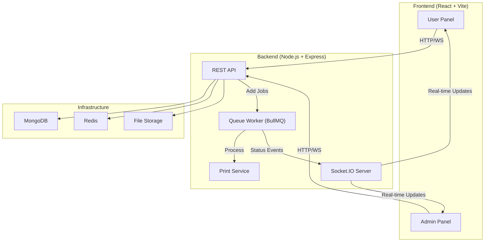

# SmartPrint Automation System — Implementation Plan

A full-stack print automation web app with user/admin panels, real-time queue management, payment integration, and automatic printer dispatch.

---

## User Review Required

> [!IMPORTANT]
> **Payment Gateway Choice**: The plan integrates **Stripe** (test mode) by default. If you prefer **Razorpay** or **UPI-only**, let me know and I'll swap the integration.

> [!IMPORTANT]
> **Database Choice**: The plan uses **MongoDB** with Mongoose. If you prefer **PostgreSQL** with Prisma, I can adjust.

> [!WARNING]
> **Printer Integration**: Real printer dispatch (via `pdf-to-printer` on Windows or CUPS on Linux) requires a physical/network printer. The system will include a **simulated printer service** for development, with a pluggable interface for production printers.

> [!IMPORTANT]
> **File Storage**: The plan uses **local disk storage** (`uploads/` directory) for development. For production, I'll add an AWS S3 / Firebase Storage adapter. Let me know if you want S3 from the start.

---

## Open Questions

1. **Do you have a Stripe account** (even test mode)? If not, I'll use a fully simulated payment flow that can be swapped out.
2. **Do you have MongoDB installed locally**, or should I include a Docker Compose setup for MongoDB + Redis?
3. **Do you want email/SMS notifications** via a real provider (SendGrid, Twilio), or in-app notifications only for now?
4. **Multi-printer support** — should this be included in V1, or deferred?

---

## Architecture Overview



---

## Tech Stack

| Layer | Technology | Purpose |
|:---|:---|:---|
| **Frontend** | React 18 + TypeScript + Vite | SPA with user & admin panels |
| **Styling** | Vanilla CSS (custom design system) | Dark mode, glassmorphism, animations |
| **Routing** | React Router v6 | Client-side navigation |
| **State** | Zustand | Lightweight global state |
| **Backend** | Node.js + Express | REST API server |
| **Auth** | JWT (access + refresh tokens) | Secure authentication |
| **Database** | MongoDB + Mongoose | Document store for orders, users |
| **Queue** | Redis + BullMQ | FIFO job queue with priorities |
| **Real-time** | Socket.IO | Live queue position & ETA updates |
| **Payments** | Stripe (test mode) | Payment processing |
| **Printing** | `pdf-to-printer` (Win) / CUPS (Linux) | Physical printer dispatch |
| **File Upload** | Multer + local disk | File handling (S3-ready adapter) |
| **Containerization** | Docker + Docker Compose | Deployment-ready |

---

## Proposed Changes

### Project Root Structure

```
e:\printing\
├── docker-compose.yml
├── .env.example
├── .gitignore
├── README.md
│
├── frontend/                  # React + Vite SPA
│   ├── index.html
│   ├── package.json
│   ├── vite.config.ts
│   └── src/
│       ├── main.tsx
│       ├── App.tsx
│       ├── index.css          # Design system + global styles
│       ├── assets/
│       ├── components/        # Shared UI components
│       ├── features/          # Feature-based modules
│       │   ├── auth/
│       │   ├── upload/
│       │   ├── orders/
│       │   ├── queue/
│       │   ├── payment/
│       │   ├── notifications/
│       │   └── admin/
│       ├── hooks/
│       ├── lib/               # Socket, API client, utils
│       ├── pages/
│       └── types/
│
├── backend/                   # Express API server
│   ├── package.json
│   ├── tsconfig.json
│   └── src/
│       ├── server.ts          # Entry point
│       ├── app.ts             # Express app setup
│       ├── config/
│       │   ├── db.ts
│       │   ├── redis.ts
│       │   └── env.ts
│       ├── middleware/
│       │   ├── auth.ts
│       │   ├── upload.ts
│       │   ├── errorHandler.ts
│       │   └── validate.ts
│       ├── models/
│       │   ├── User.ts
│       │   ├── Order.ts
│       │   └── PrintJob.ts
│       ├── routes/
│       │   ├── auth.routes.ts
│       │   ├── order.routes.ts
│       │   ├── admin.routes.ts
│       │   └── payment.routes.ts
│       ├── controllers/
│       ├── services/
│       │   ├── queue.service.ts
│       │   ├── print.service.ts
│       │   ├── payment.service.ts
│       │   ├── storage.service.ts
│       │   ├── eta.service.ts
│       │   └── notification.service.ts
│       ├── workers/
│       │   └── print.worker.ts
│       ├── socket/
│       │   └── index.ts
│       └── utils/
└── docs/
    └── api.md                 # API documentation
```

---

### Component 1: Design System & Frontend Foundation

#### [NEW] [package.json](file:///e:/printing/frontend/package.json)
- React 18, TypeScript, Vite, React Router v6, Zustand, Socket.IO client, Axios, react-dropzone

#### [NEW] [index.css](file:///e:/printing/frontend/src/index.css)
- Complete design system: CSS custom properties for colors, spacing, typography
- Dark mode as default with glassmorphism effects
- Utility classes, responsive grid system
- Component-specific styles (cards, buttons, inputs, badges, progress bars)
- Smooth micro-animations and transitions
- Google Font: Inter

#### [NEW] [App.tsx](file:///e:/printing/frontend/src/App.tsx)
- React Router setup with protected routes
- Layout system with sidebar navigation
- Auth context provider
- Socket.IO connection provider

---

### Component 2: Authentication System

#### [NEW] [auth feature](file:///e:/printing/frontend/src/features/auth/)
- `LoginPage.tsx` — Email/password login with animated form
- `SignupPage.tsx` — Registration with validation
- `useAuth.ts` — Auth hook with JWT token management
- `authStore.ts` — Zustand store for auth state

#### [NEW] [auth.routes.ts](file:///e:/printing/backend/src/routes/auth.routes.ts)
- `POST /api/auth/signup` — Register user (bcrypt hashing)
- `POST /api/auth/login` — Login, return JWT
- `POST /api/auth/refresh` — Refresh token
- `GET /api/auth/me` — Get current user

#### [NEW] [User.ts](file:///e:/printing/backend/src/models/User.ts)
- Schema: name, email, password (hashed), role (user/admin), createdAt

---

### Component 3: Document Upload & Order Creation

#### [NEW] [upload feature](file:///e:/printing/frontend/src/features/upload/)
- `UploadPage.tsx` — Drag & drop file upload with preview
- `FilePreview.tsx` — Document preview component (PDF viewer, image viewer)
- `PrintOptions.tsx` — Form for copies, print type (B&W/Color), page size (A4/A3/Letter)
- `OrderSummary.tsx` — Review before payment

#### [NEW] [upload.ts middleware](file:///e:/printing/backend/src/middleware/upload.ts)
- Multer config: accept PDF, DOCX, JPG, PNG
- File size limit: 25MB
- File validation (magic bytes check)

#### [NEW] [order.routes.ts](file:///e:/printing/backend/src/routes/order.routes.ts)
- `POST /api/orders` — Create order with file upload
- `GET /api/orders` — List user's orders
- `GET /api/orders/:id` — Get order details + queue position
- `DELETE /api/orders/:id` — Cancel order (if still queued)

#### [NEW] [Order.ts](file:///e:/printing/backend/src/models/Order.ts)
- Schema: userId, fileUrl, fileName, fileType, fileSize, pageCount, copies, printType, pageSize, status (pending_payment → queued → printing → completed → cancelled), orderId (unique), paymentId, queuePosition, estimatedTime, totalPrice, createdAt

---

### Component 4: Payment Integration

#### [NEW] [payment feature](file:///e:/printing/frontend/src/features/payment/)
- `PaymentPage.tsx` — Stripe Elements checkout form
- `PaymentSuccess.tsx` — Confirmation with order ID display

#### [NEW] [payment.routes.ts](file:///e:/printing/backend/src/routes/payment.routes.ts)
- `POST /api/payments/create-intent` — Create Stripe PaymentIntent
- `POST /api/payments/webhook` — Stripe webhook handler
- `GET /api/payments/:orderId` — Get payment status

#### [NEW] [payment.service.ts](file:///e:/printing/backend/src/services/payment.service.ts)
- Stripe SDK integration
- Payment intent creation with order metadata
- Webhook signature verification
- On success: update order status → add to print queue

---

### Component 5: Queue Management System (Core)

#### [NEW] [queue.service.ts](file:///e:/printing/backend/src/services/queue.service.ts)
- BullMQ queue setup with Redis
- FIFO processing with priority override capability
- Job data: orderId, fileUrl, pageCount, copies, printType, pageSize
- Events: job added, job active, job completed, job failed
- Queue position calculation for all waiting jobs

#### [NEW] [eta.service.ts](file:///e:/printing/backend/src/services/eta.service.ts)
- **ETA Algorithm**:
  ```
  estimatedTime = Σ (pages_i × copies_i × timePerPage) for all jobs ahead
  timePerPage = colorMode === 'color' ? 8 seconds : 5 seconds
  ```
- Dynamic recalculation on queue changes
- Travel time suggestion (configurable shop distance)

#### [NEW] [print.worker.ts](file:///e:/printing/backend/src/workers/print.worker.ts)
- BullMQ Worker that processes print jobs
- Fetches file from storage
- Dispatches to print service
- Updates order status: queued → printing → completed
- Emits real-time events via Socket.IO

#### [NEW] [queue feature](file:///e:/printing/frontend/src/features/queue/)
- `QueueTracker.tsx` — Real-time queue position display
- `ProgressBar.tsx` — Animated progress indicator
- `ETADisplay.tsx` — Countdown timer with estimated completion

---

### Component 6: Real-time Updates (Socket.IO)

#### [NEW] [socket/index.ts](file:///e:/printing/backend/src/socket/index.ts)
- Socket.IO server attached to Express HTTP server
- JWT authentication middleware for sockets
- Rooms: `user:{userId}` for personal updates, `admin` for admin dashboard
- Events emitted:
  - `queue:update` — Queue position changed
  - `order:status` — Order status changed
  - `eta:update` — ETA recalculated
  - `job:completed` — Print job finished
  - `notification` — In-app notification

#### [NEW] [useSocket.ts](file:///e:/printing/frontend/src/hooks/useSocket.ts)
- Socket connection hook with auto-reconnect
- Event listeners with Zustand store integration

---

### Component 7: Admin Panel

#### [NEW] [admin feature](file:///e:/printing/frontend/src/features/admin/)
- `AdminDashboard.tsx` — Overview with stats cards (total orders, revenue, active prints)
- `OrdersTable.tsx` — Sortable/filterable table of all orders
- `QueueManager.tsx` — Visual queue with drag-to-reorder, pause/cancel/prioritize controls
- `OrderDetail.tsx` — View uploaded file, request metadata, print status
- `Analytics.tsx` — Charts for daily prints, revenue (Chart.js)

#### [NEW] [admin.routes.ts](file:///e:/printing/backend/src/routes/admin.routes.ts)
- `GET /api/admin/dashboard` — Dashboard stats
- `GET /api/admin/orders` — All orders with filters
- `PATCH /api/admin/orders/:id/status` — Update order status
- `POST /api/admin/orders/:id/prioritize` — Move to front of queue
- `POST /api/admin/orders/:id/pause` — Pause print job
- `POST /api/admin/orders/:id/cancel` — Cancel print job
- `GET /api/admin/analytics` — Daily/weekly/monthly analytics data

---

### Component 8: Print Service

#### [NEW] [print.service.ts](file:///e:/printing/backend/src/services/print.service.ts)
- **Interface-based design** with pluggable backends:
  - `SimulatedPrinter` — For development (logs + delays)
  - `WindowsPrinter` — Uses `pdf-to-printer` for Windows
  - `CupsPrinter` — Uses CUPS for Linux/macOS
- Print job lifecycle: fetch file → validate → send to printer → confirm → cleanup
- Auto-delete files after successful print (configurable retention)

---

### Component 9: Notification System

#### [NEW] [notification.service.ts](file:///e:/printing/backend/src/services/notification.service.ts)
- In-app notifications via Socket.IO (default)
- Pluggable email adapter (SendGrid-ready)
- Notification types: order_confirmed, printing_started, print_completed, order_cancelled

#### [NEW] [notifications feature](file:///e:/printing/frontend/src/features/notifications/)
- `NotificationBell.tsx` — Bell icon with unread count badge
- `NotificationPanel.tsx` — Dropdown with notification history
- `useNotifications.ts` — Hook for notification state

---

### Component 10: Shared UI Components

#### [NEW] [components/](file:///e:/printing/frontend/src/components/)
- `Sidebar.tsx` — Collapsible navigation sidebar
- `Header.tsx` — Top bar with user menu, notifications
- `ProtectedRoute.tsx` — Auth guard for routes
- `Button.tsx` — Styled button with variants (primary, secondary, danger, ghost)
- `Input.tsx` — Form input with validation states
- `Card.tsx` — Glassmorphic card component
- `Badge.tsx` — Status badges (pending, printing, completed)
- `Modal.tsx` — Animated modal overlay
- `Spinner.tsx` — Loading spinner
- `Toast.tsx` — Toast notification system
- `FileIcon.tsx` — File type icon renderer
- `EmptyState.tsx` — Empty state illustrations

---

### Component 11: Infrastructure & Deployment

#### [NEW] [docker-compose.yml](file:///e:/printing/docker-compose.yml)
```yaml
services:
  frontend, backend, mongodb, redis
```

#### [NEW] [.env.example](file:///e:/printing/.env.example)
- All required environment variables documented

#### [NEW] [docs/api.md](file:///e:/printing/docs/api.md)
- Complete API documentation with request/response examples

---

## UI/UX Design Decisions

| Aspect | Decision |
|:---|:---|
| **Theme** | Dark mode default with deep navy (#0a0e1a) base |
| **Accent Colors** | Electric blue (#3b82f6) primary, emerald (#10b981) success, amber (#f59e0b) warning |
| **Glass Effects** | Semi-transparent cards with backdrop blur |
| **Typography** | Inter font family, fluid sizing |
| **Animations** | Framer-motion-like CSS transitions on route changes, card hovers, status updates |
| **Layout** | Sidebar + main content, responsive → bottom tab bar on mobile |
| **Queue Visualization** | Vertical timeline with animated progress nodes |

---

## Verification Plan

### Automated Tests
```bash
# Backend unit tests
cd backend && npm test

# Frontend build check
cd frontend && npm run build
```

### Manual Verification
1. **Auth Flow**: Sign up → Login → Access protected routes → Logout
2. **Upload Flow**: Upload PDF → Set options → Preview → Submit
3. **Payment Flow**: Create order → Stripe test payment → Order confirmed
4. **Queue Flow**: Multiple orders → Real-time position updates → ETA countdown
5. **Admin Flow**: Login as admin → View dashboard → Manage queue → Override controls
6. **Print Flow**: Job reaches top → Auto-dispatched → Status updates → Completion notification
7. **Responsive**: Test on mobile viewport (375px) and desktop (1440px)
8. **Docker**: `docker-compose up` should bring up entire stack

---

## Estimated Effort

| Phase | Components | Estimate |
|:---|:---|:---|
| **Phase 1** | Project setup, Design system, Auth | Foundation |
| **Phase 2** | Upload, Orders, File handling | Core functionality |
| **Phase 3** | Queue system, ETA, Real-time | Heart of the system |
| **Phase 4** | Payment integration | Monetization |
| **Phase 5** | Admin panel, Analytics | Management |
| **Phase 6** | Print service, Notifications | Automation |
| **Phase 7** | Docker, API docs, Polish | Production-ready |

I will build all phases sequentially, delivering a fully functional system.
