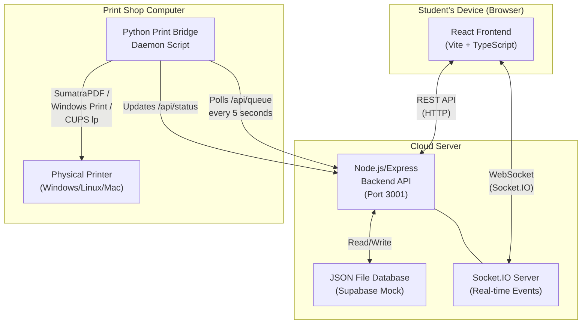
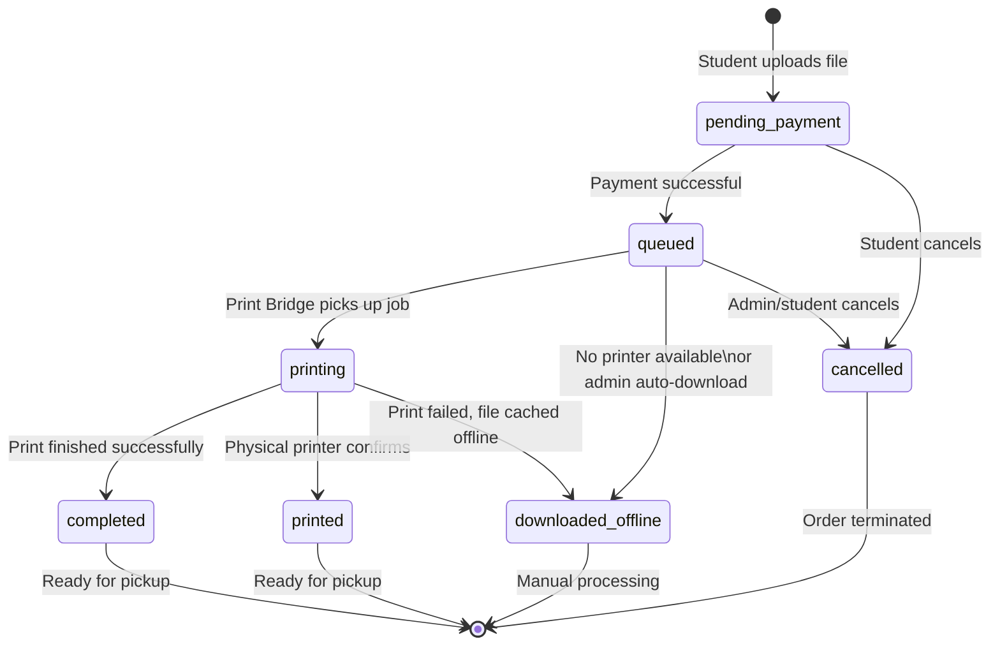
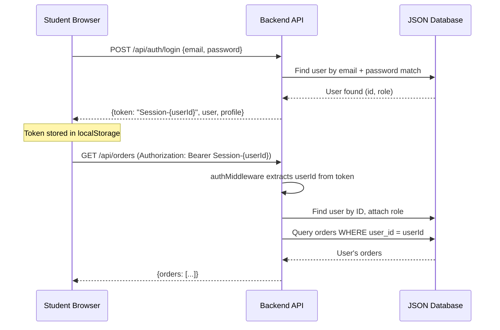
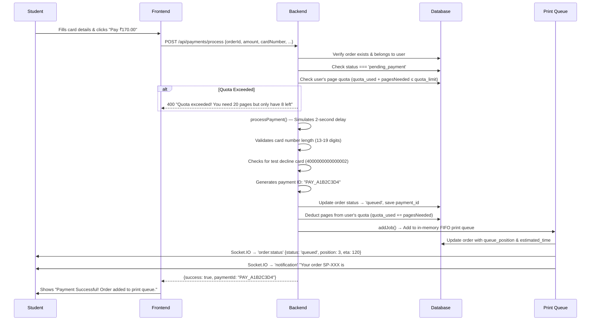
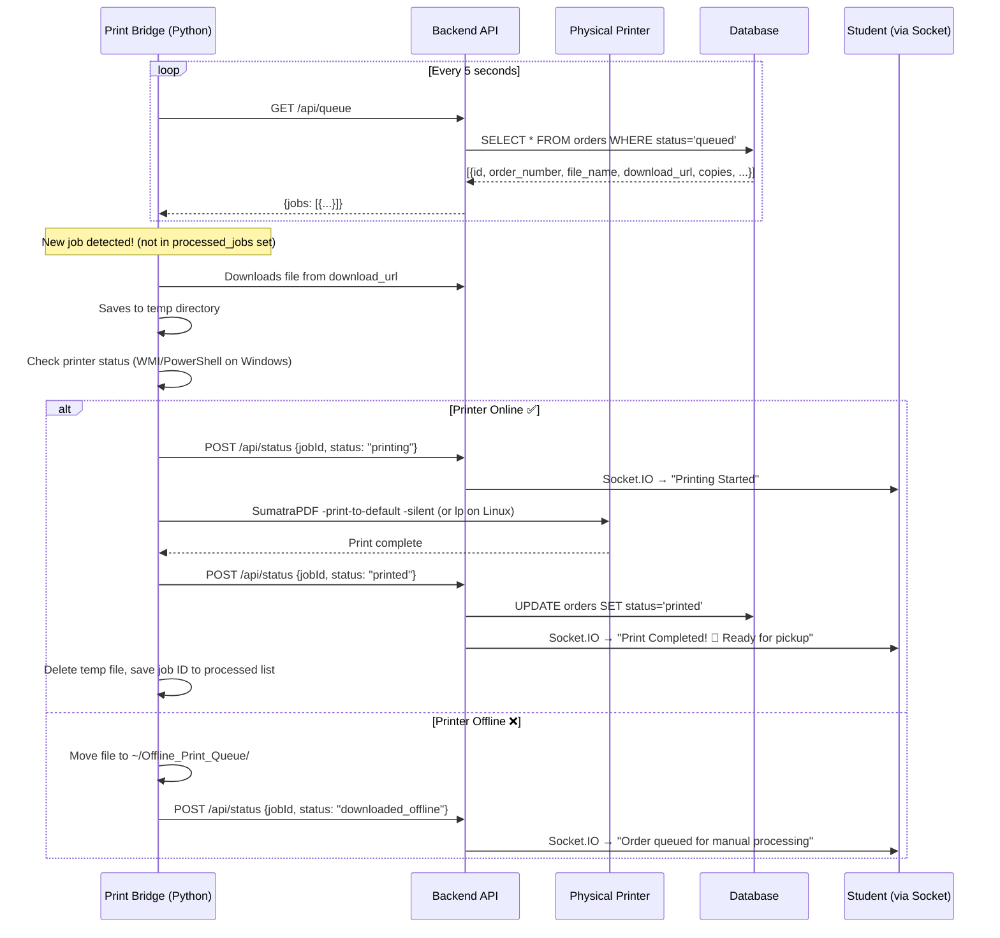
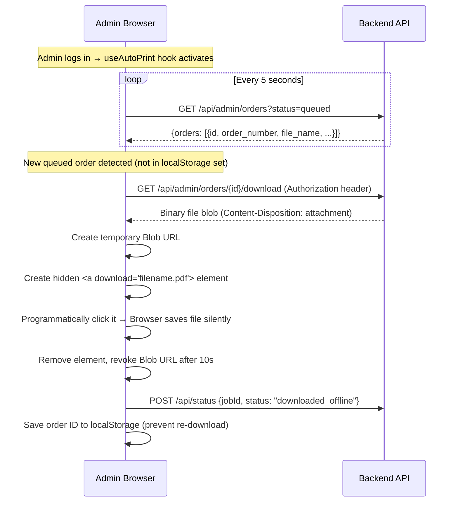
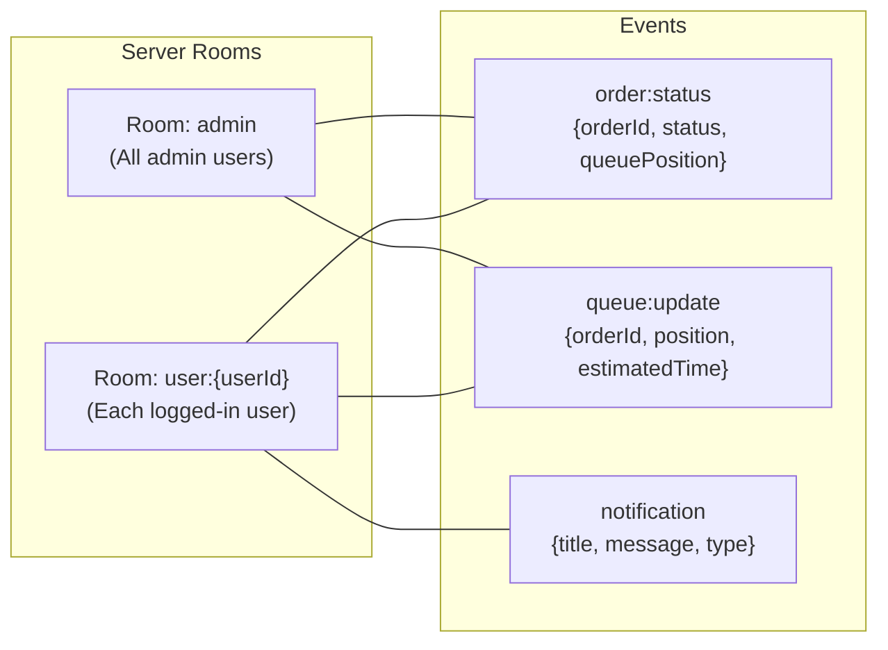
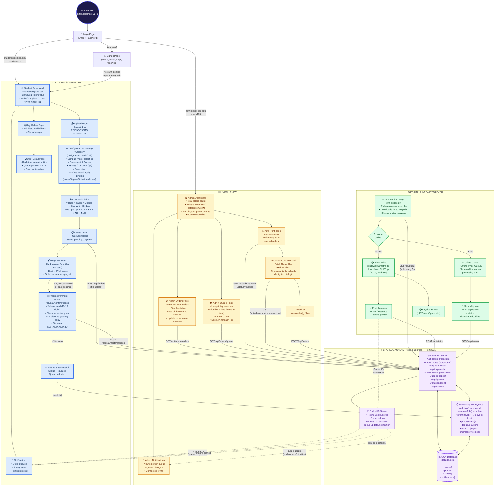

# SmartPrint — Academic Print Automation System
## Comprehensive Project Report for HOD Review

---

## 1. Project Overview

**SmartPrint** is a full-stack web application that automates the entire academic document printing workflow in a college/university environment. It replaces the manual "go to the print shop, wait in line, hand over a USB" process with a fully digital system where students upload documents online, pay digitally, and the system automatically sends files to the physical printer — **without any human intervention at the print shop**.

### Problem Statement

In most academic institutions, the printing workflow is:
1. Student copies file to USB drive
2. Walks to the print shop
3. Waits in a physical queue
4. Hands file to operator, explains settings (B&W, copies, binding, etc.)
5. Operator opens file, prints manually
6. Student pays cash, collects printout

This is **time-consuming, error-prone, and unscalable**.

### Solution

SmartPrint digitizes every step:

| Manual Process | SmartPrint Equivalent |
|---|---|
| Copy file to USB | Upload PDF/DOCX via web portal |
| Walk to shop & wait | Track queue position in real-time from anywhere |
| Explain settings verbally | Select options digitally (copies, color, binding, paper size) |
| Operator prints manually | **Automatic silent printing via Print Bridge daemon** |
| Pay cash | Simulated digital payment gateway |
| Collect printout | Get notification when print is ready for pickup |

---

## 2. System Architecture — The Big Picture

The system consists of **four major components** that work together:



### Component Breakdown

| Component | Technology | Location | Purpose |
|---|---|---|---|
| **Frontend** | React 18 + Vite + TypeScript | `frontend/` | Student & admin web portal |
| **Backend API** | Node.js + Express + TypeScript | `backend/` | REST API, business logic, file storage |
| **Database** | JSON file-based (Supabase mock) | `data/db.json` | Stores users, orders, notifications, profiles |
| **Real-Time Engine** | Socket.IO | Integrated in backend | Live order status updates, notifications |
| **Print Bridge** | Python 3 script | `print_bridge.py` | Hardware automation agent for physical printing |
| **Auto-Print Hook** | React hook (admin browser) | `useAutoPrint.ts` | Browser-based file download fallback |

---

## 3. How the Backend Works — Step by Step

The backend is built with **Express.js** (Node.js web framework) running on **port 3001**. Here is how it processes every request:

### 3.1 Server Startup Sequence

When `npm run dev` starts the backend:

1. **Environment Loading** → Reads `.env` file for configuration (port, CORS origin, upload directory, max file size)
2. **Database Loading** → Reads `data/db.json` from disk into in-memory arrays (`mockUsers`, `mockOrders`, `mockProfiles`, `mockNotifications`)
3. **If no `db.json` exists** → Auto-creates 3 default accounts:
   - `admin@college.edu` / `admin123` (Admin role, 9999 page quota)
   - `student@college.edu` / `student123` (Student role, 100 page quota)
   - `professor@college.edu` / `professor123` (Professor role, 500 page quota)
4. **Express Middleware Setup** → Helmet (security headers), CORS, JSON parser, static file serving
5. **Socket.IO Initialization** → WebSocket server for real-time events
6. **Route Registration** → Auth, Orders, Payments, Admin routes
7. **Server Listens** → Ready on `http://localhost:3001`

### 3.2 Database Design (File-Based JSON)

> [!IMPORTANT]
> The project uses a **custom-built mock Supabase client** that stores all data in `data/db.json`. This makes the project run **without any external database server** — zero dependencies beyond Node.js and npm.

The database has **4 tables** (stored as arrays in the JSON file):

#### `users` Table
```
id          → UUID (auto-generated)
email       → User's email (unique)
password    → Plain text (simulated — would be bcrypt in production)
role        → 'user' or 'admin'
```

#### `profiles` Table
```
id           → UUID (matches users.id)
full_name    → Display name
role         → 'user' or 'admin'
department   → Academic department (e.g., "Computer Science")
quota_limit  → Max pages per semester (Students: 100, Faculty: 500)
quota_used   → Pages already consumed
created_at   → Timestamp
```

#### `orders` Table
```
id              → UUID (auto-generated)
user_id         → References users.id
order_number    → Unique string like "SP-M3X2F-K9L"
file_name       → Original uploaded file name
file_path       → Server-side path to stored file
file_type       → MIME type (application/pdf, image/png, etc.)
file_size       → Size in bytes
page_count      → Number of pages
copies          → Number of copies requested
print_type      → 'bw' (Black & White) or 'color'
page_size       → 'A4', 'A3', 'Letter', or 'Legal'
status          → Order lifecycle state (see below)
queue_position  → Position in print queue (null if not queued)
estimated_time  → ETA in seconds
total_price     → Calculated price in ₹
payment_id      → Payment transaction ID
category        → 'assignment', 'lab_manual', 'thesis', 'office', 'other'
printer_name    → Selected campus printer
binding_type    → 'none', 'stapled', 'spiral', 'hardcover'
created_at      → Timestamp
updated_at      → Timestamp
```

#### `notifications` Table
```
id         → UUID (auto-generated)
user_id    → References users.id
title      → Notification title
message    → Notification body
type       → 'info', 'success', 'warning', 'error'
read       → Boolean (has user seen it?)
created_at → Timestamp
```

### 3.3 Order Lifecycle — All Status States

Every order goes through this state machine:



### 3.4 API Endpoints

| Method | Endpoint | Auth | Purpose |
|---|---|---|---|
| `POST` | `/api/auth/register` | ❌ | Create new student/faculty account |
| `POST` | `/api/auth/login` | ❌ | Login, get session token |
| `GET` | `/api/auth/me` | ✅ | Get current user profile |
| `POST` | `/api/orders` | ✅ | Upload file & create order (multipart) |
| `GET` | `/api/orders` | ✅ | Get user's order history |
| `GET` | `/api/orders/:id` | ✅ | Get single order details |
| `PATCH` | `/api/orders/:id/cancel` | ✅ | Cancel an order |
| `GET` | `/api/orders/user/notifications` | ✅ | Get user's notifications |
| `POST` | `/api/payments/process` | ✅ | Process payment for an order |
| `GET` | `/api/queue` | ❌ | Poll for queued jobs (used by Print Bridge) |
| `POST` | `/api/status` | ❌ | Update job status (used by Print Bridge) |
| `GET` | `/api/admin/dashboard` | 🔒 Admin | Dashboard stats (revenue, counts) |
| `GET` | `/api/admin/orders` | 🔒 Admin | All orders with filters |
| `GET` | `/api/admin/queue` | 🔒 Admin | Current print queue |
| `PATCH` | `/api/admin/orders/:id/status` | 🔒 Admin | Update order status |
| `POST` | `/api/admin/orders/:id/prioritize` | 🔒 Admin | Move order to front of queue |
| `POST` | `/api/admin/orders/:id/cancel` | 🔒 Admin | Cancel order from queue |
| `GET` | `/api/admin/orders/:id/download` | 🔒 Admin | Download file for auto-print |
| `GET` | `/api/health` | ❌ | Health check |

### 3.5 Authentication Flow



The token format is `Session-{userId}`. The auth middleware:
1. Extracts the token from the `Authorization: Bearer <token>` header
2. Strips `Session-` prefix to get the user ID
3. Looks up the user in the database
4. Attaches `req.user = { id, email, role }` to the request
5. For admin routes, an additional `adminMiddleware` checks `req.user.role === 'admin'`

---

## 4. How Money Transfer / Payment Works

### 4.1 Pricing Algorithm

The system calculates printing cost using this formula:

```
Total Price = (Base Price × Page Count × Copies × Size Multiplier) + Binding Cost
```

| Parameter | Values |
|---|---|
| **Base Price** | B&W: ₹2/page, Color: ₹5/page |
| **Size Multiplier** | A4: 1.0×, Letter: 1.0×, Legal: 1.2×, A3: 1.5× |
| **Binding Cost** | None: ₹0, Stapled: ₹0, Spiral: ₹20, Hardcover: ₹50 |

**Example**: 10-page Color A3 document, 2 copies, spiral binding:
```
= (₹5 × 10 × 2 × 1.5) + ₹20
= ₹150 + ₹20
= ₹170.00
```

### 4.2 Payment Processing Flow

> [!NOTE]
> The payment gateway is **simulated** for demonstration. In production, this would be replaced with Razorpay, Stripe, or a UPI integration.



### 4.3 Payment Validation Rules

The simulated gateway performs these checks:
- Card number must be 13–19 digits (after removing spaces)
- Amount must be greater than ₹0
- Card `4000 0000 0000 0002` → always declined (test decline card)
- Card `4242 4242 4242 4242` → always approved (test success card, pre-filled in UI)
- All other valid card numbers → approved

### 4.4 Semester Quota System

Each user has a printing quota:
- **Students**: 100 pages per semester
- **Professors/Faculty**: 500 pages per semester
- **Admins**: 9,999 pages (effectively unlimited)

Before processing payment, the system checks:
```
if (quota_used + (pageCount × copies) > quota_limit) → REJECT
```

After successful payment:
```
quota_used += (pageCount × copies)
```

---

## 5. How Automatic Printing Works

This is the **most critical feature** of the project. There are **two mechanisms** for automatic printing:

### 5.1 Mechanism 1: Print Bridge Daemon (Physical Printer — Primary)

The **Print Bridge** is a Python script (`print_bridge.py`) that runs on the **print shop computer** (the computer connected to the physical printer). It acts as the hardware automation agent.

#### How It Works — Step by Step



#### Printer Detection — Cross-Platform

| Platform | Method | Command |
|---|---|---|
| **Windows** | WMI via PowerShell | `Get-CimInstance Win32_Printer \| Where Default` |
| **Windows (fallback)** | Win32 API | `win32print.GetDefaultPrinter()` |
| **Linux/macOS** | CUPS | `lpstat -d` and `lpstat -p <printer>` |

The system checks:
- Is there a default printer defined?
- Is it marked as "Work Offline"?
- Is the status code indicating an error (offline=7, paper out=8)?

#### Silent Printing — How Files Print Without User Interaction

| Platform | PDF Method | Other Files |
|---|---|---|
| **Windows** | SumatraPDF (`-print-to-default -silent`) | `Start-Process -Verb Print -Wait` |
| **Linux/macOS** | `lp -n <copies> <file>` | Same |

**SumatraPDF** is a lightweight PDF viewer that supports **command-line silent printing** — no window opens, no dialog appears. The file goes directly to the default printer's spooler.

For non-PDF files (DOCX, images), Windows' native `Start-Process -Verb Print` is used, which opens the default handler for that file type and sends it to the printer.

#### Duplicate Prevention

The Print Bridge maintains a **processed jobs set** stored in `~/.smartprint_processed_jobs.json`:
- Before processing any job, it checks if the job ID is already in this set
- After successfully printing (or caching offline), it adds the job ID
- This persists across restarts — the bridge won't re-print jobs after a crash/reboot

### 5.2 Mechanism 2: Admin Browser Auto-Download (Fallback — No Physical Printer Needed)

If no Print Bridge is running (or no physical printer is available), there's a **browser-based fallback** using the `useAutoPrint` React hook.

#### How It Works



Key technical details:
- Uses the HTML5 `download` attribute on anchor tags to force save-to-disk
- Chrome/Edge download the file **silently** to the default Downloads folder
- No permission dialog, no pop-up — the admin just sees files appearing in their Downloads folder
- Persisted download tracking via `localStorage` to prevent duplicates across page refreshes

---

## 6. Real-Time Communication — Socket.IO

The system uses **Socket.IO** (WebSocket protocol) for instant push notifications. Without this, users would need to manually refresh the page to see updates.

### Events Architecture



| Event | Recipient | When Triggered |
|---|---|---|
| `order:status` | Specific user | Order status changes (queued → printing → completed) |
| `queue:update` | Specific user | Queue position or ETA changes |
| `queue:update` | All admins | Any queue modification (add, remove, prioritize) |
| `notification` | Specific user | New notification created |

### What the Student Sees in Real-Time

1. **"Order Queued"** → Position #3, ETA: 2 minutes
2. **Queue moves** → Position #2, ETA: 1 minute
3. **"Printing Started"** → Your order is now being printed!
4. **"Print Completed! 🎉"** → Ready for pickup

All of this happens **without the student refreshing the page**.

---

## 7. FIFO Queue System

The print queue is an **in-memory FIFO (First In, First Out)** queue managed by `queue.service.ts`.

### Queue Operations

| Operation | Description |
|---|---|
| `addJob(job)` | Append to end of queue, assign position, calculate ETA |
| `removeJob(orderId)` | Remove from queue, re-calculate all positions |
| `prioritizeJob(orderId)` | Move job to front of queue (admin only) |
| `processNext()` | Dequeue first job, simulate/print it, then process next |
| `getQueue()` | Return current queue state for admin dashboard |

### ETA Calculation Algorithm

```
Time per page:
  - B&W: 5 seconds/page
  - Color: 8 seconds/page

Size multiplier:
  - A4: 1.0x, Letter: 1.0x, A3: 1.3x, Legal: 1.1x

Job time = pageCount × copies × timePerPage × sizeMultiplier

ETA for position N = Sum of job times for positions 0 through N
```

**Example**: If 3 jobs are ahead:
- Job 1: 5 pages B&W A4 = 5 × 5 × 1.0 = 25 seconds
- Job 2: 10 pages Color A3 = 10 × 8 × 1.3 = 104 seconds  
- Job 3 (yours): 3 pages B&W A4 = 3 × 5 × 1.0 = 15 seconds
- **Your ETA: 25 + 104 + 15 = 144 seconds ≈ 2.5 minutes**

### Simulated vs Physical Printing Mode

The system supports **two modes** controlled by the `USE_PHYSICAL_PRINTER` environment variable:

| Mode | Trigger | What Happens |
|---|---|---|
| **Simulated** (default) | `USE_PHYSICAL_PRINTER` not set | Backend auto-processes queue with time delays |
| **Physical** | `USE_PHYSICAL_PRINTER=true` | Backend adds to queue only; Print Bridge handles actual printing |

In simulated mode, `processNext()` calls `simulatePrint()` which just waits for the calculated time (capped at 30 seconds for development), then marks the order as completed.

---

## 8. Frontend Architecture

### Technology Stack

| Library | Purpose |
|---|---|
| **React 18** | UI component framework |
| **Vite** | Build tool & dev server (port 5173) |
| **TypeScript** | Type safety |
| **React Router v6** | Client-side routing |
| **Zustand** | Lightweight state management |
| **Socket.IO Client** | Real-time WebSocket events |
| **Axios** | HTTP client for API calls |
| **react-dropzone** | Drag & drop file upload |

### Page Structure

| Page | Route | Role | Purpose |
|---|---|---|---|
| Login | `/login` | Public | Email/password authentication |
| Signup | `/signup` | Public | Create new student account |
| Dashboard | `/` | Student | Welcome banner, quota tracker, printer status, recent orders |
| Upload | `/upload` | Student | Upload document, configure settings, inline payment |
| Orders | `/orders` | Student | Full order history with status badges |
| Order Detail | `/orders/:id` | Student | Single order tracking with real-time updates |
| Payment | `/payment/:orderId` | Student | Standalone payment page (alternative to inline) |
| Admin Dashboard | `/admin` | Admin | Revenue stats, order counts, system overview |
| Admin Orders | `/admin/orders` | Admin | Manage all orders, filter, update status |
| Admin Queue | `/admin/queue` | Admin | Live print queue management, prioritize, cancel |

### State Management (Zustand Stores)

| Store | Data Managed |
|---|---|
| `authStore` | Current user, profile, login/signup/logout actions |
| `orderStore` | User's orders, create/update/fetch actions |
| `notificationStore` | In-app notifications, unread count |

---

## 9. Combined Process Flow Architecture — Student & Admin

The diagram below shows the **complete system process flow** for both the Student (User) and Admin roles in a single architecture, illustrating how their workflows converge through the shared backend, database, print queue, and printing infrastructure.



### Reading the Diagram — Color Legend

| Color | Component | Description |
|---|---|---|
| 🔵 **Blue** | Student Flow | Everything the student interacts with |
| 🟡 **Yellow** | Admin Flow | Everything the admin interacts with |
| 🟣 **Purple** | Shared Backend | API, Database, Queue, Socket.IO — used by both roles |
| 🟢 **Green** | Printing Infrastructure | Print Bridge, hardware checks, physical printer |

### Key Interaction Points Between Admin & User

1. **Same Login Page** → Role determines redirect (Student → Dashboard, Admin → Admin Dashboard)
2. **Same Database** → Admin sees ALL orders; Student sees only their own
3. **Same Print Queue** → Student's payment adds jobs; Admin can prioritize/cancel them
4. **Same Socket.IO Server** → Student gets personal notifications; Admin gets queue-wide updates
5. **Same Print Bridge** → Processes jobs regardless of who submitted them
6. **Admin Auto-Download** → Acts as a fallback when no physical printer is available, downloading student files automatically

---

## 10. File Upload & Storage

### Upload Flow

1. Student selects file via drag-and-drop or file browser
2. Frontend validates: PDF, DOCX, JPG, PNG only; max 25 MB
3. File sent as `multipart/form-data` to `POST /api/orders`
4. **Multer middleware** saves file to `backend/uploads/` directory with unique timestamp filename (e.g., `1753120000000-123456789.pdf`)
5. Order record created in database with `file_path` pointing to stored file
6. Original filename preserved in `file_name` field

### File Serving

Uploaded files are served as static files:
```
http://localhost:3001/uploads/1753120000000-123456789.pdf
```

The Print Bridge uses this URL to download files for printing.

---

## 11. How to Run the Project

### One-Command Startup

```bash
python run.py
```

This script:
1. Starts the **backend** Express server (port 3001)
2. Starts the **frontend** Vite dev server (port 5173)
3. Waits 4 seconds for servers to initialize
4. Opens `http://localhost:5173` in the default browser
5. Monitors both processes; Ctrl+C stops both

### Running Print Bridge (Separate Terminal)

```bash
pip install requests
python print_bridge.py
```

This starts the polling daemon that connects to the backend and handles physical printing.

### Default Login Credentials

| Role | Email | Password |
|---|---|---|
| Admin | `admin@college.edu` | `admin123` |
| Student | `student@college.edu` | `student123` |
| Professor | `professor@college.edu` | `professor123` |

---

## 12. Security Features

| Feature | Implementation |
|---|---|
| **Authentication** | Token-based (Bearer tokens in Authorization header) |
| **Authorization** | Role-based (user vs admin) with middleware checks |
| **CORS** | Restricted to frontend origin (localhost:5173) |
| **Helmet** | Security headers (XSS protection, content type sniffing prevention) |
| **File Validation** | MIME type whitelist (PDF, DOCX, JPG, PNG) |
| **File Size Limit** | Maximum 25 MB per upload |
| **Input Validation** | Print type, page size, copies validated server-side |
| **Ownership Checks** | Users can only access their own orders |
| **Quota Enforcement** | Server-side page quota check before payment processing |

---

## 13. Technology Summary Table

| Layer | Technology | Version | Purpose |
|---|---|---|---|
| Frontend Framework | React | 18.x | UI components |
| Build Tool | Vite | Latest | Fast HMR, bundling |
| Language | TypeScript | 5.x | Type safety |
| State Management | Zustand | Latest | Lightweight global state |
| HTTP Client | Axios | Latest | API communication |
| File Upload | react-dropzone | Latest | Drag & drop UX |
| Backend Framework | Express.js | 4.x | REST API server |
| Real-Time | Socket.IO | 4.x | WebSocket events |
| File Upload (server) | Multer | Latest | Multipart form handling |
| Database | Custom JSON mock | N/A | Supabase-compatible API |
| Print Automation | Python 3 + requests | 3.x | Hardware bridge |
| PDF Printing | SumatraPDF / CUPS | Latest | Silent print execution |
| Containerization | Docker Compose | Available | Optional deployment |

---

## 14. Future Production Enhancements

| Area | Current (Demo) | Production Upgrade |
|---|---|---|
| Database | JSON file | PostgreSQL (Supabase) |
| Payment | Simulated gateway | Razorpay / Stripe / UPI |
| Authentication | Simple session tokens | JWT with refresh tokens + bcrypt passwords |
| File Storage | Local disk | Supabase Storage / AWS S3 |
| Printing | SumatraPDF / ShellExecute | Enterprise print management (PaperCut) |
| Deployment | localhost | Docker + Cloud (AWS/GCP/Azure) |
| Monitoring | Console logs | Sentry + Grafana + structured logging |

---

> [!TIP]
> **Key Takeaway for HOD**: This project demonstrates a complete, working **end-to-end automation system** — from student file upload → digital payment → automatic queue management → silent hardware printing → real-time notification. Every component is functional and can be demonstrated live with the default test accounts.

---

## 15. Conclusion

### What Was Achieved

The **SmartPrint Academic Print Automation System** successfully demonstrates a fully functional, end-to-end solution that digitizes and automates the entire campus printing workflow. The system eliminates the need for manual file transfer, physical queuing, and cash-based payment — replacing each with a modern, web-based alternative.

The following capabilities have been implemented and are fully operational:

| # | Capability | Status |
|---|---|---|
| 1 | Student self-service file upload with drag-and-drop | ✅ Working |
| 2 | Configurable print settings (color, copies, paper size, binding) | ✅ Working |
| 3 | Dynamic pricing engine with automatic cost calculation | ✅ Working |
| 4 | Simulated digital payment gateway with card validation | ✅ Working |
| 5 | Semester-based page quota enforcement per student | ✅ Working |
| 6 | FIFO print queue with real-time position tracking and ETA | ✅ Working |
| 7 | Automatic silent printing via Python Print Bridge (no manual intervention) | ✅ Working |
| 8 | Offline fallback — files cached locally when printer is unavailable | ✅ Working |
| 9 | Admin browser auto-download as a secondary print mechanism | ✅ Working |
| 10 | Real-time notifications via WebSocket (Socket.IO) | ✅ Working |
| 11 | Role-based access control (Student vs Admin dashboards) | ✅ Working |
| 12 | Admin panel with revenue tracking, order management, and queue control | ✅ Working |
| 13 | Cross-platform printer detection (Windows WMI, Linux/macOS CUPS) | ✅ Working |
| 14 | Persistent data storage with file-based JSON database | ✅ Working |

### Learning Outcomes

Through the development of this project, the following technical and professional skills were applied:

1. **Full-Stack Web Development** — Building a production-grade application with a React frontend and Node.js/Express backend, communicating via REST APIs.
2. **Real-Time Systems** — Implementing bidirectional WebSocket communication using Socket.IO for instant push notifications and live status tracking.
3. **System Integration** — Bridging web software with physical hardware (printers) using a Python daemon that orchestrates OS-level print commands (SumatraPDF, Windows ShellExecute, CUPS).
4. **Database Design** — Designing a relational schema (users, profiles, orders, notifications) with referential integrity, and building a custom ORM-like query builder.
5. **Payment Systems** — Understanding payment flow architecture: validation → processing → confirmation → queue insertion, with idempotency and error handling.
6. **Queue Theory & Scheduling** — Implementing a FIFO queue with priority override, ETA calculation based on job parameters, and automatic sequential processing.
7. **Security Practices** — Token-based authentication, role-based authorization, CORS configuration, input validation, file type whitelisting, and request rate protection via Helmet.
8. **Cross-Platform Engineering** — Writing code that adapts to Windows, Linux, and macOS for both printer detection and print execution.
9. **DevOps Awareness** — Docker Compose configuration for containerized deployment, environment variable management, and graceful shutdown handling.

### Scope for Future Work

The current system is a fully functional prototype designed for demonstration and academic evaluation. For real-world deployment in an institution, the following upgrades would be made:

- Integration with **Razorpay/UPI** for real payment processing
- Migration to **PostgreSQL (Supabase)** for enterprise-grade data persistence
- **JWT authentication** with bcrypt password hashing for production security
- Cloud deployment on **AWS/Azure/GCP** with Docker containers
- Integration with enterprise print management software like **PaperCut**
- Mobile-responsive PWA for student access from smartphones

---

> **Project Title**: SmartPrint — Academic Print Automation System
>
> **Submitted By**:
> - Name: ____________________________
> - Roll No: ____________________________
> - Department: ____________________________
> - Academic Year: ____________________________
>
> **Guided By**: ____________________________
>
> **Date of Submission**: ____________________________

